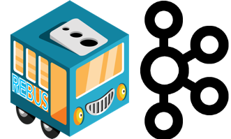

# Rebus.Kafka

Rebus Transport for Kafka.

This library was developed by Agoda Developers to use [Kafka](https://kafka.apache.org/) messaging system with Rebus. It allows you to use the Lean service bus abstraction from Rebus in combination with the power of scale that Kafka offers.

